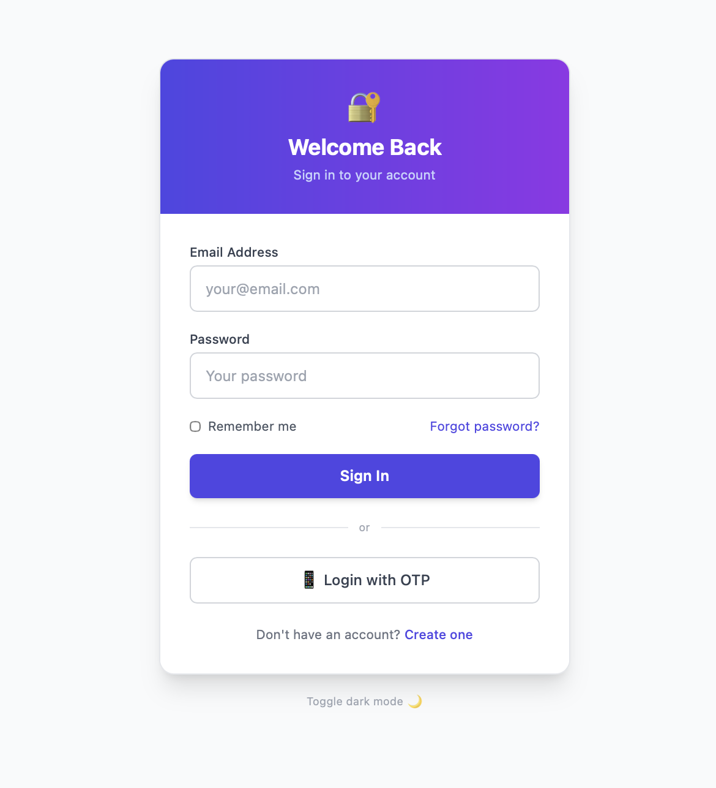
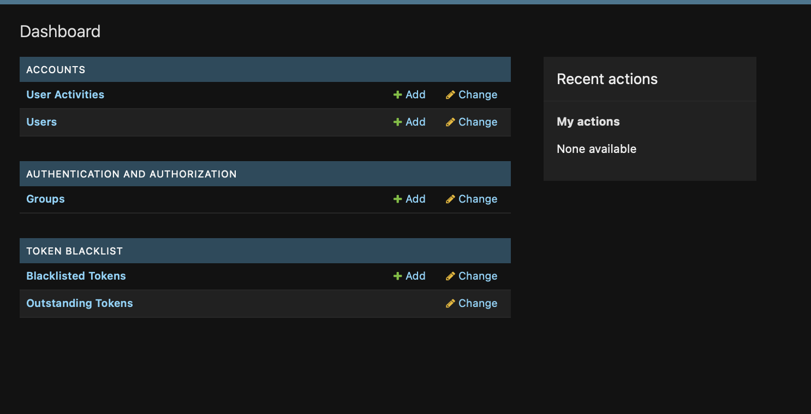
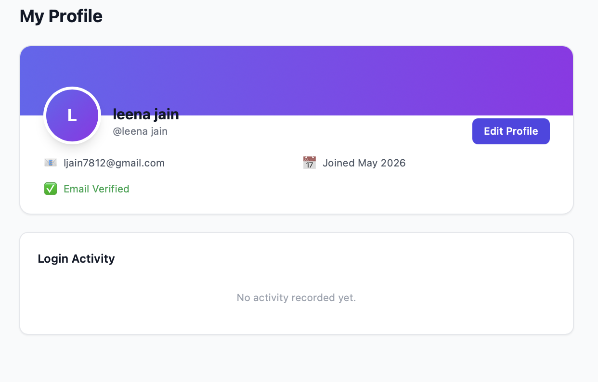
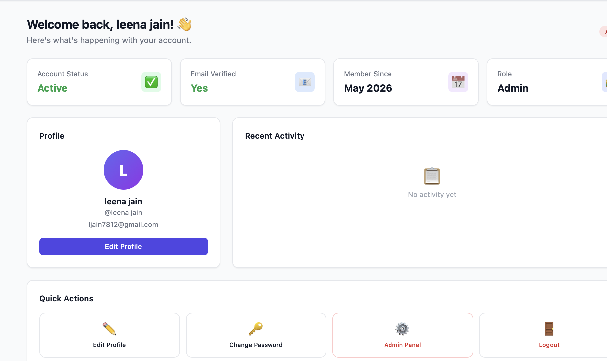

# 🔐 AuthProject - Full Django Authentication System

Modern Django authentication system with JWT, OTP, Roles, and beautiful Tailwind UI.

## ✨ Features

| Feature | Status |
|---------|--------|
| User Registration | ✅ |
| Login / Logout | ✅ |
| Forgot Password | ✅ |
| Email Verification | ✅ |
| OTP Login | ✅ |
| Profile Page | ✅ |
| Profile Photo Upload | ✅ |
| Change Password | ✅ |
| Custom Admin Panel | ✅ |
| User Roles (admin/user/seller) | ✅ |
| JWT Authentication (REST API) | ✅ |
| Dark Mode | ✅ |
| Responsive UI (Tailwind) | ✅ |
| Activity Logging | ✅ |

## 🚀 Quick Start

### 1. Project setup karo

```bash
# Virtual environment banao
python -m venv venv
source venv/bin/activate   # Windows: venv\Scripts\activate

# Dependencies install karo
pip install -r requirements.txt
```

### 2. Database migrate karo

```bash
python manage.py makemigrations
python manage.py migrate
```

### 3. Superuser banao

```bash
python manage.py createsuperuser
# Email, username, password enter karo
```

### 4. Server chalao

```bash
python manage.py runserver
```

Browser mein kholo: **http://127.0.0.1:8000**

---

## 📁 Project Structure

```
authproject/
├── authproject/
│   ├── settings.py        # Django settings, JWT, email config
│   ├── urls.py            # Main URL routing
│   └── wsgi.py
│
├── accounts/
│   ├── models.py          # CustomUser model (UUID pk, roles, OTP)
│   ├── views.py           # All views (register, login, OTP, admin...)
│   ├── forms.py           # All forms with Tailwind styling
│   ├── admin.py           # Django admin config
│   ├── urls.py            # accounts/ URL patterns
│   ├── api_urls.py        # /api/ REST endpoints
│   ├── api_views.py       # DRF API views
│   ├── serializers.py     # DRF serializers
│   └── templates/
│       └── accounts/      # All HTML templates
│
├── templates/
│   └── base.html          # Base layout with navbar + dark mode
│
├── static/                # CSS, JS files
├── media/                 # User uploaded photos
├── manage.py
└── requirements.txt
```

---

## 🔗 URL Routes

### Web Pages
| URL | View | Auth |
|-----|------|------|
| `/accounts/register/` | Registration | Public |
| `/accounts/login/` | Login | Public |
| `/accounts/logout/` | Logout | Login required |
| `/accounts/otp-login/` | OTP Step 1 | Public |
| `/accounts/otp-verify/` | OTP Step 2 | Public |
| `/accounts/forgot-password/` | Forgot Password | Public |
| `/accounts/reset-password/<token>/` | Reset Password | Public |
| `/accounts/verify-email/<token>/` | Email Verify | Public |
| `/accounts/dashboard/` | Dashboard | Login required |
| `/accounts/profile/` | Profile View | Login required |
| `/accounts/profile/edit/` | Profile Edit | Login required |
| `/accounts/change-password/` | Change Password | Login required |
| `/accounts/admin-panel/` | Admin Panel | Admin only |

### REST API Endpoints
| Endpoint | Method | Description |
|----------|--------|-------------|
| `/api/auth/register/` | POST | Register new user |
| `/api/auth/login/` | POST | Get JWT tokens |
| `/api/auth/logout/` | POST | Blacklist token |
| `/api/auth/token/refresh/` | POST | Refresh access token |
| `/api/user/profile/` | GET/PUT | View/update profile |
| `/api/user/change-password/` | POST | Change password |
| `/api/admin/users/` | GET | List all users (admin) |

---

## 🔑 JWT API Usage

### Login karke token lo:
```bash
curl -X POST http://localhost:8000/api/auth/login/ \
  -H "Content-Type: application/json" \
  -d '{"email": "user@example.com", "password": "password123"}'
```

### Response:
```json
{
  "tokens": {
    "access": "eyJ0eXAiOiJKV1QiLCJhbGc...",
    "refresh": "eyJ0eXAiOiJKV1QiLCJhbGc..."
  },
  "user": { "email": "...", "role": "user" }
}
```

### Protected endpoint call karo:
```bash
curl -H "Authorization: Bearer <access_token>" \
  http://localhost:8000/api/user/profile/
```

---

## 👥 User Roles

| Role | Permissions |
|------|-------------|
| `user` | Dashboard, Profile, Change Password |
| `seller` | Same as user (extend as needed) |
| `admin` | All above + Admin Panel, user management |

Admin role dene ke liye (Django shell):
```python
python manage.py shell
from accounts.models import CustomUser
user = CustomUser.objects.get(email='user@example.com')
user.role = 'admin'
user.save()
```

---

## 📧 Email Configuration

`settings.py` mein console backend hai (development):
```python
EMAIL_BACKEND = 'django.core.mail.backends.console.EmailBackend'
```

Production mein Gmail SMTP use karo:
```python
EMAIL_BACKEND = 'django.core.mail.backends.smtp.EmailBackend'
EMAIL_HOST = 'smtp.gmail.com'
EMAIL_PORT = 587
EMAIL_USE_TLS = True
EMAIL_HOST_USER = 'your@gmail.com'
EMAIL_HOST_PASSWORD = 'your_app_password'
```

---

## 🌙 Dark Mode

Navbar mein moon icon click karo. Preference localStorage mein save hoti hai.

---

## 🗄️ MySQL Setup (Production)

`settings.py` mein comment out karo aur yeh use karo:
```python
DATABASES = {
    'default': {
        'ENGINE': 'django.db.backends.mysql',
        'NAME': 'authdb',
        'USER': 'root',
        'PASSWORD': 'your_password',
        'HOST': 'localhost',
        'PORT': '3306',
    }
}
```
MySQL driver: `pip install mysqlclient`

---

## 🔒 Security Notes

- Passwords bcrypt se hash hote hain (Django default)
- JWT tokens rotate hote hain aur blacklist hote hain logout par
- Password reset tokens 24 hours mein expire
- OTP 10 minutes mein expire
- CSRF protection har form par
- Role-based access control decorators se
=======
# authproject-django
Django authentication system with login, signup and dashboard functionality.

# AuthProject Django

Django authentication system with login, signup, OTP login and dashboard functionality.

## Features
- User Authentication
- OTP Login
- Profile Management
- Admin Dashboard
- Dark Mode
- Email Verification

## Screenshots

### Login Page


### Dashboard


### Profile Page


### Admin Panel
